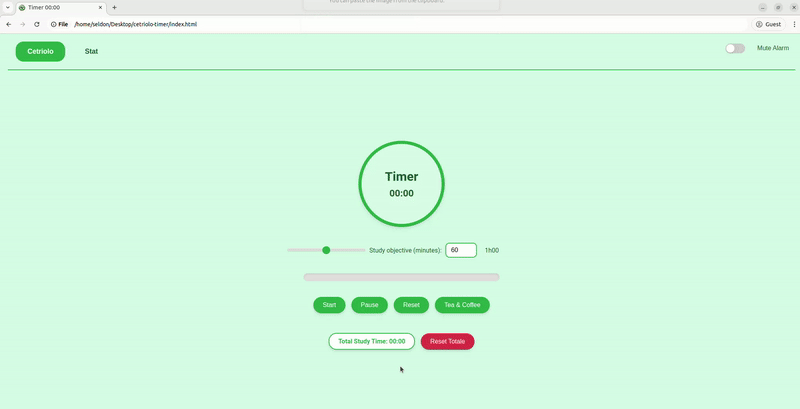

# Cucumber Timer (Cetriolo Timer) 🥒

A simple and flexible **time management tool** designed to help you adapt your study or work schedule—just like a cucumber adapts to its environment.

---

## Philosophy of the **Cucumber Timer**

The **Cucumber Timer** is inspired by the philosophy of the cucumber: just as a cucumber can grow to different lengths depending on the season and time of year, our study or work time can vary based on the time of day and our mood.

This app helps you **adapt your study or work rhythm** to your daily needs, just like a cucumber adapts to its environment to grow. With the **Cucumber Timer**, you can manage your time flexibly, balancing productivity and breaks naturally.

- **Morning?** You might prefer longer and more intense sessions.
- **Afternoon?** Shorter but more frequent sessions might work best.
- **Evening?** A more relaxed approach could be the way to go.

The **Cucumber Timer** is here to remind you that your time is not fixed; like a cucumber, it can grow, adapt, and change depending on **how you feel and what you need**.

---

## Features

- **Start**, **Pause**, **Reset**, and real-time study tracking (Study Time).
- Configurable **Study objective** (in minutes) to set personal goals.
- **Tea & Coffee break** button for quick rest or breaks when needed.
- **Mute Alarm** toggle to easily control sound notifications.
- **Reset Totale** to restore all counters and timers to the initial state.

---

## Demo Video

  

---

## Under Development

- **Stat** section (statistics) is currently under development to provide insights and data on your study sessions.

---

## How to Run the App

1. **Clone or download** the repository to your local machine.
2. **Open `index.html`** in your preferred browser (e.g., Chrome, Firefox, Safari).

That’s it! You’re ready to start tracking your time like a cucumber grows in the garden.

---

## License

This project is licensed under the [Apache License 2.0](./LICENSE).

Enjoy growing your productivity with the **Cucumber Timer**! 🥒

